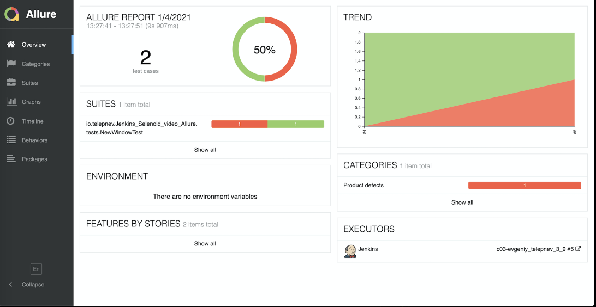

Параметризация в коде и в Jenkins. Подключаем Allure Reports
1. Настройка запуска ui-автотестов с удаленным контейнером (Selenoid)
2. Добавление параметризации к сборке автотестов и джобе в Jenkins
3. Добавление Allure Reports в задачу Jenkins.
4. Вложения в Allure-отчете - скриншоты, лог консоли, видео

